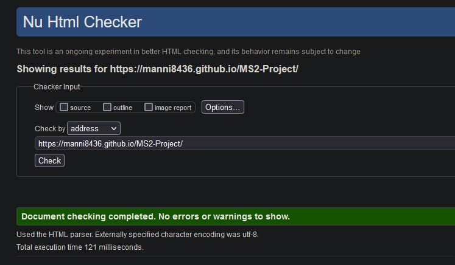

# Pharaoh`s Match

Visit the deployed site: [Pharaoh`s Match](https://manni8436.github.io/MS2-Project)

## INITIAL DESIGN

My initial idea for this project was to create a fun, interactive card-matching game with an Egyptian theme that can be enjoyed by anyone. My target audience is anyone interested in games and Egyptian Mythology. The target demographic is incredibly mixed and covers people of all ages and genders.

* The main features that I wanted to include are:
  * Easy to use layout.
  * Easy to read instructions.
  * A bright but subtle color scheme that is eye-catching but isn't overwhelming.
  * Hover feature with a background color indicator that is clear and precise, to be used while making a selection.
  * A score counter allows the user to know how many points they have received.
  * A moves counter allows the user to know how many moves they have taken to complete the game.

## CONTENTS

* [User Experience](#user-experience)  
* [Design](#design)
* [Wireframes](#wireframes)
* [Features](#features)
* [Known Bugs](#known-bugs)
* [Technologies Used](#technologies-used)
* [Deployment](#deployment)
* [Testing](#testing)
* [Content](#content)
* [Acknowledgments](#acknowledgments)

## USER EXPERIENCE

The structure of this site was designed to be simple and easy to use while having a good balance of fun factor and brightness.
I also didn't want to overload the user with the color scheme, so as not to strain the user's vision while they are playing.

* The website was designed for the following user types:
  * Users that enjoy playing card-matching games.
  * Users that have basic knowledge of Egyptian history.
  * Users who have a passion and enjoy anything to do with Egyptian mythology.

## USER STORIES

### CLIENT GOALS

* The site needs to be easily accessible.
* Maneuvering around the site to be straightforward to use.
* The site is easy to read, understandable and sees all images correctly.
* The site to have a clear indication of what has been selected while playing.

### FIRST TIME VISITORS

* I want the site to be easy to understand on how to navigate throughout the site.
* I want the instructions to be clear, understandable and easily read.
* I want the first-time user to be able to understand how to play quickly so as not to get frustrated.

## DESIGN

## COLOUR SCHEME

This color scheme was used throughout the site.

The colors below were used for the hover effect and the colours of the buttons.

## WIREFRAMES

[Here are my wireframes for desktop, mobile and tablet for this project](assets/wireframes/MSProject2wireframes.pdf)

## FEATURES

## FUTURE IMPLEMENTATIONS

* Add a timer that counts to zero.
* Scoreboard which will keep track of all the games being played and scores.
* Music in the background.

## KNOWN BUGS

|  Bug Encountered         | Code                  | Live Site Image |
| :----------------------: | :-------------------: | :-------------: |
|  While styling my page, I realised that my footer was a lighter colour than my header, upon looking into dev tools to see if there is any issues, none were found |  |   |
| As per bug above, I changed to a different colour to see if this issue would be replicated, as suspected, The issue was confirmed. | |     |
| A bug was found when additional boxes were added, the bug itself seems to be highlighting in between the tiles, click once and a small area is highlighted but if you click again then multiple areas get highlighted. To try to resolve this bug, I have tried the following `whitespace: nowrap`, `white-space: unset;`, `white-space: normal;` and `white-space: pre-wrap;` | Also Attempted to use this JQuery code , However none have worked so far. | |

## SOLVED BUGS

|  Bug Encountered   |   Bug   | Solution |
| :----------------: | :-----: | :------: |
|  While trying to get my javascript functionality working, I found a bug relating to referencing my boxes variable, as shown below with the error messages.||||
|A second bug was found due to the issue above, After looking closely at these bugs, I had to change my for loop inside the function.|||
|While working on my project functionality, and upon getting my onclick randomisation function to work, a bug was found which made this functionality stop working. At first I was under the assumption that it was a randomisation bug, however after trying a few combinations of functions and loops, I had come to the conclusion that it was an onclick bug and a solution was found.|||

## TECHNOLOGIES USED

### LANGUAGES

### VERSION CONTROL

### FRAMESWORKS & LIBRARIES

### BROWSERS

### WIREFRAMES

### SITE DEPLOYMENT

## DEPLOYMENT

### INITIAL DEPLOYMENT

This site was deployed using GitHub Pages with the following steps below:

1. Login or Sign Up to [GitHub](www.github.com).
2. Create a new repository named "MS2-Project".
3. Once created, click on "Settings" on the navigation bar under the repository title.
4. Click on "Pages", on the left-hand side below Secrets.
5. Under "Source", choose which branch you wish to deploy, In most cases, it will be "main".
6. Choose which folder to deploy from, generally from "/root".
7. Click "Save", then wait for it to be deployed. It may take some time for the page to be fully deployed.
8. The URL will be displayed above the "source" section in GitHub Pages.

### HOW TO FORK A REPOSITORY

If you need to make a copy of a repository:

1. Login or Sign Up to [GitHub](www.github.com).
2. On GitHub, go to [manni8436/MS2-Project](manni8436/MS2-Project).
3. In the top right corner, click "Fork".

### HOW TO CLONE A REPOSITORY

If you need to make a clone:

1. Login into [GitHub](www.github.com).
2. Fork the repository manni8436/MS2-Project using the steps above in [How To Fork a Repository](#how-to-fork-a-repository).
3. Above the file list, click "Code".
4. Choose if you want to close using HTTPS, SSH or GitHub CLI, then click the copy button to the right.
5. Open Git Bash.
6. Change the directory to where you want your clone to go.
7. Type git clone and then paste the URL you copied in step 4.
8. Press Enter to create your clone.

### HOW TO MAKE A LOCAL CLONE

If you need to make a local clone:

1. Login into [GitHub](www.github.com).
2. Under the repository name, above the list of files, click "Code".
3. Here you can either Clone or Download the repository.
4. You should close the repository using HTTPS, clicking on the icon to copy the link.
5. Open Git Bash.
6. Change the current working directory to the new location, where you want the cloned directory to be.
7. Type git clone and then paste the URL you copied in step 4.
8. Press Enter, and your local clone will be created.

## TESTING

### CODE VALIDATORS

The W3C Markup and CSS Validators were used to validate my project to make sure there were no errors within the site.

|  Code Validated          |  Validator Results  ||
| :----------------------: | :-: | :------------: |
| | |
| | |
| || |
| || |
| || |

### FULL TESTING

[Click Here](testing.md) to view the full testing steps that were completed on every device and browser.

### LIGHTHOUSE

* I tested my website using Firefox Developer Tools Lighthouse feature, and received the results below:

### DESKTOP

### MOBILE

## CONTENT

### IMAGES

* Images that have been used for this project have been provided below:

  * [Back of cards](https://en.wikipedia.org/wiki/Egyptian_pyramids)

### TEXT CONTENT

* All text content was created by myself and did not use any content from any websites.

## ACKNOWLEDGMENTS
