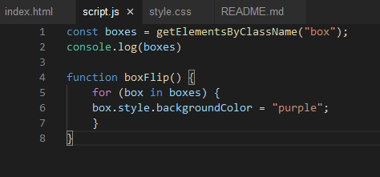
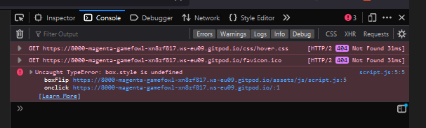

Milestone Project: Interactive Frontend Development 

# MS2-Project - Pharaoh`s Match

[Here is a link to the final project](https://manni8436.github.io/MS2-Project)

## INITIAL DESIGN

* My initial idea for this project was to create a fun, interactive card matching game with a Egyptian theme that can be enjoyed by anyone. My target 
audience is anyone who is interested in games and also Egyptian Mythology. The target demographic is incredibly mixed and covers people of all ages and genders.

* The main features that I wanted to include are:

    * Easy to use layout.
    * Easy to read instructions.
    * A bright but subtle color scheme that is eye catching but isn't overwhelming.
    * Hover feature with a background color indicator that is clear and precise, to be used while making a selection.
    
## FINAL DESIGN

 <!--add image after project has been completed-->

## CONTENTS

* [User Experience](#USER-EXPERIENCE-(UX))  
    * [User Stories](#USER-STORIES)    

* [Design](#DESIGN)   
    * [Color Scheme](#COLOR-SCHEME)

* [Wireframes](#WIREFRAMES) 

* [Technologies Used](#TECHNOLOGIES-USED) 
    * [Languages Used](#LANGUAGES-USED)
    * [Programs Used](#PROGRAMS-USED)

* [Deployment](#DEPLOYMENT)
    * [Initial Deployment](#INITIAL-DEPLOYMENT)
    * [How To Fork A Repository](#HOW-TO-FORK-A-REPOSITORY)
    * [How To Clone A Repository](#HOW-TO-CLONE-A-REPOSITORY)
    * [How To Make A Local Clone](#HOW-TO-MAKE-A-LOCAL-CLONE)

* [Testing](#TESTING)
    * [Code Validators](#CODE-VALIDATORS)

* [Content](#CONTENT)
    * [Images](#IMAGES)
    * [Text Content](#TEXT-CONTENT)

* [Acknowledgements](#ACKNOWLEDGEMENTS)    

## USER EXPERIENCE (UX)

The structure of this site was designed to be simple and easy to use while having a good balance of fun factor and brightness. 
I also didn't want to overload the user with the color scheme, so as not to strain the user's vision while they are playing.

* The website was designed for the following user types:
    * Users that enjoy playing card matching games.
    * Users that have basic knowledge of the Egyptian history.
    * Users who have a passion and enjoy anything to do with Egyptian mythology.

## USER STORIES

#### CLIENT GOALS

* The site needs to be easily accessible.
* Manouvering around the site to be simple and straightforwards to use.
* The site to be easy to read, understandable and be able to see all images clearly.
* The site to have clear indication of what has been selected while playing.

#### FIRST TIME VISITORS

* I want the site to be easy to understand on how to navigate throughout the site.
* I want the instructions to be clear, understandable and easily read.
* I want the first time user to be able to understand how to play quickly as not to get frustrated.

## DESIGN

## COLOR SCHEME

My overall color scheme used throught out the site.

   

* The colours below were used for the hover affect and the colours of the buttons.

  

## WIREFRAMES

[Here are my wireframes for desktop, mobile and tablet for this project](assets/wireframes/MSProject2wireframes.pdf)

## FEATURES

## FUTURE IMPLEMENTATIONS
* to add a timer that counts to zero
* scores which will keep track of the scores while playing
* score board which will keep track of all the games been played and scores
* reset/restart button
* music in the background

## KNOWN BUGS
1. While styling my page, I realised that my footer was a lighter colour then my header, upon looking into dev tools and to see if there is any issues, 
none were found, I also changed to a different colour to see if it would do the same and the second colour, the same thing happened.

## SOLVED BUGS

1. While trying to get my javascript functionality working, a bug was found and upon looking into the console the error below was given.

 
 

2. a second bug below was found due to the issue above

after looking closely at these bugs, I had to change my for loop inside the function, I have added error images above and the solution code below for documentation.

3. A bug was found when additional boxes were added, the bug itself seems to be highlighting in between the tiles, click once and a small area is highlighted
but if you click again then multiple areas get highlighted.

To try to resolve this bug, I have tried the following `whitespace: nowrap`, `white-space: unset;`, `white-space: normal;` and `white-space: pre-wrap;` 

also tried to use the JQuery code below.

none have worked as of yet.

4. While trying to get my JavaScript functionality and upon getting my onclick randomisation function to work a bug was found which made my onclick function stop working which are below.

at first I thought that this was a randomisation bug but after trying a few combinations of functions and loops I have realised that infact this is was a onclick bug and a solution code has been found for this bug.

## TECHNOLOGIES USED

### LANGUAGES USED

       

### PROGRAMS USED

#### Font Awesome:
[Font Awesome](https://fontawesome.com/) was using for a few icons used in the footer aspect of the site pages.

#### Google Fonts:
[Google Fonts](https://fonts.google.com/) was used for all the text content on the site pages.

#### GitPod:
GitPod was used to write up the code for my project and using the GitPod terminal to commit everything to GitHub.
    
#### GitHub:
GitHub is being used to store all the code for this project after being pushed from GitPod.

#### Balsamiq:
Balsamiq was used in the initial design process to make wireframes.

#### Firefox Developer Tools:
Firefox Developer Tools was used for trouble shooting and trying new visual changes without it affect the current code already created.

## DEPLOYMENT:

### INITIAL DEPLOYMENT

This site was deployed using GitHub Pages with the following the steps below:

1. Login or Sign Up to [GitHub](www.github.com).
2. Create a new repository named "MS2-Project".
3. Once created, click on "Settings" on the navigation bar under the repository title.
4. Click on "Pages", on the left hand side below Secrets.
5. Under "Source", choose which branch you wish to deploy, In most cases it will be "main".
6. Choose which folder to deploy from, generally from "/root".
7. Click "Save", then wait for it to be deployed. It may take some time for the page to be fully deployed.
8. The URL will be displayed above the "source" section in GitHub Pages.

### HOW TO FORK A REPOSITORY

If you need to make a copy of a repository:

1. Login or Sign Up to [GitHub](www.github.com).
2. On GitHub, go to [manni8436/MS2-Project](manni8436/MS2-Project).
3. In the top right corner, click "Fork".

### HOW TO CLONE A REPOSITORY

If you need to make a clone:    

1. Login in to [GitHub](www.github.com).
2. Fork the repository manni8436/MS2-Project using the steps above in [How To Fork a Repository](#HOW-TO-FORK-A-REPOSITORY).
3. Above the file list, click "Code".
4. Choose if you want to close using HTTPS, SSH or GitHub CLI, then click the copy button to the right.
5. Open Git Bash.
6. Change the directory to where you want your clone to go.
7. Type git clone and then paste the URL you copied in step 4.
8. Press Enter to create your clone.

### HOW TO MAKE A LOCAL CLONE

If you need to make a local clone:   

1. Login in to [GitHub](www.github.com).
2. Under the repository name, above the list of files, click "Code".
3. Here you can either Clone or Download the repository.
4. You should close the repository using HTTPS, clicking on the icon to copy the link.
5. Open Git Bash.
6. Change the current working directory to the new locaiton, where you want the cloned directory to be.
7. Type git clone and then paste the URL you copied in step 4.
8. Press Enter, and your local clone will be created.

## TESTING

### CODE VALIDATORS

The W3C Markup Validator and W3C CSS Validator was used to validate my project to make sure there were no errors within the site.

* W3C HTML Validator Results
    * [HTML](https://validator.w3.org/nu/?doc=https%3A%2F%2Fmanni8436.github.io%2FMS2-Project%2F)
* W3C CSS Validator Results
    * [CSS](http://www.css-validator.org/validator?uri=https%3A%2F%2Fmanni8436.github.io%2FMS2-Project%2F&profile=css21&usermedium=all&warning=1&lang=en)
* JavaScript Validator
    
    
     

### FULL TESTING

[Click Here](testing.md) to view the full testing steps that were completed on every device and browser.

### LIGHTHOUSE

* I tested my website using Firefox Developer Tools Lighthouse feature, and received the results below:

### DESKTOP

### MOBILE

## CONTENT

### IMAGES

* Images that have been used for this project have been provided below:

    * [Back of cards](https://en.wikipedia.org/wiki/Egyptian_pyramids)

## ACKNOWLEDGEMENTS